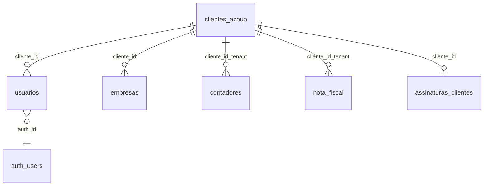
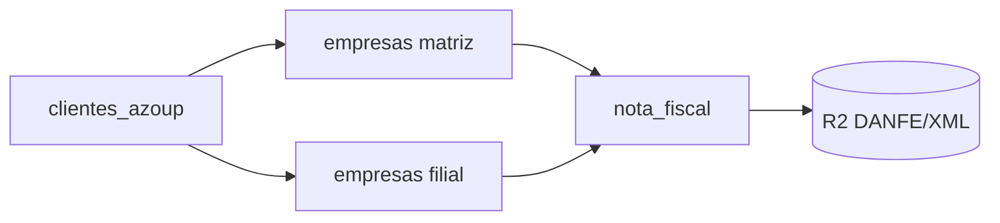
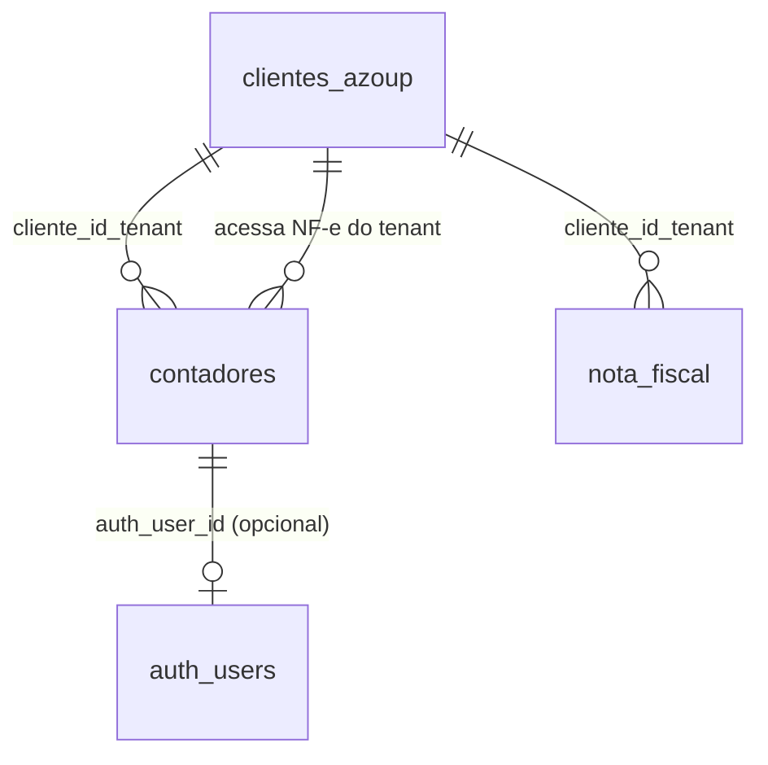
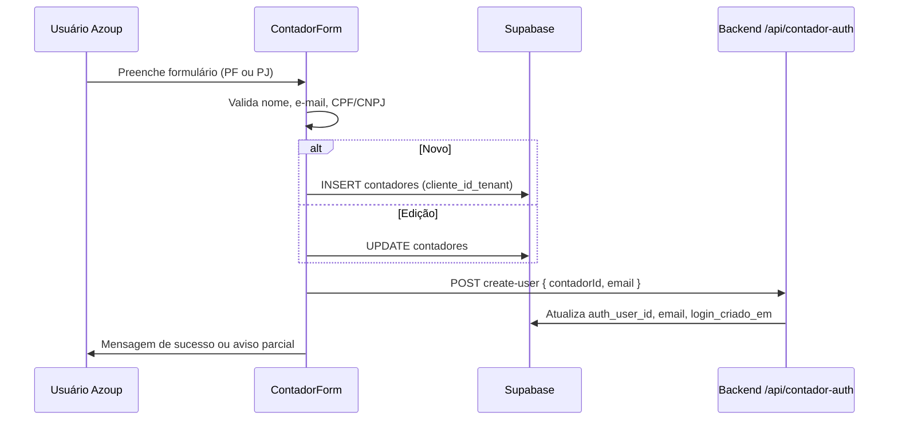

# Especificação: Sistema de Consulta de NF-e (emitidas e canceladas)

Documento de referência para criar um **projeto separado** (nova pasta) que lista apenas notas fiscais **autorizadas** e **canceladas**, com ações de **visualizar/baixar DANFE (PDF)** e **baixar XML**.

Este sistema **reutiliza o mesmo banco Supabase, storage (Cloudflare R2) e backend Node** do Azoup/RNWebSupabase. Não precisa reemitir NF-e nem editar pedidos — apenas consulta e download.

---

## 1. Objetivo do produto

| Funcionalidade | Descrição |
|----------------|-----------|
| Listagem | Exibir NF-e com status SEFAZ autorizado (`100`) ou cancelado (`101`, `135`, `155`) |
| Filtros | Empresa emitente (`empresas` do tenant), período, número NF, chave, cliente destinatário, busca textual |
| DANFE | Abrir PDF em nova aba ou download (`NFe_{numero}.pdf`) |
| XML | Download do XML autorizado (`nfeProc`) ou XML de cancelamento quando existir |
| Autenticação | Usuários internos (`usuarios`) e, no futuro, **contadores** cadastrados em `contadores` com login Supabase Auth |
| Cadastro contador | Feito no Azoup (Configurações → Financeiro → Contadores); o app de consulta **consome** o vínculo `auth_user_id` |
| Fora do escopo | Emitir NF-e, editar nota, CC-e, inutilização, manifesto, cadastros completos do ERP |

---

## 2. Arquitetura recomendada (projeto novo)

```
consulta-nfe/                    ← nova pasta (repo separado ou monorepo)
├── frontend/                    ← SPA leve (React + Vite ou Expo Web)
│   ├── .env                     ← EXPO_PUBLIC_* ou VITE_*
│   └── src/
│       ├── pages/ListaNFe.jsx
│       ├── services/supabase.js
│       └── services/nfeApi.js   ← chamadas ao backend
├── backend/                     ← OPCIONAL se reutilizar o backend atual
│   └── (copiar só rotas GET ou apontar para API existente)
└── README.md
```

**Opção A (recomendada):** frontend novo + **mesmo backend** `RNWebSupabase/backend` (já tem DANFE/XML).

**Opção B:** frontend novo + backend mínimo só com 2–3 rotas GET (DANFE/XML) copiadas de `backend/index.js`.

**Opção C:** tudo no frontend via Supabase direto (lista + `xml_url`/`danfe_url` públicas) — **não recomendado** para XML em coluna `xml_autorizado` grande e geração DANFE sob demanda.

---

## 3. Layout e identidade visual (padrão Azoup)

O app de consulta deve **parecer parte da família Azoup**, mesmo em pasta/repo separado. Referências visuais: `NotaFiscalList.js`, `OrigemPedidoList.js`, `LoginScreen.js`, `ThemeContext.js`, `DashboardScreen.js` (área principal).

### 3.1 Princípios gerais

| Princípio | Diretriz |
|-----------|----------|
| Marca | Laranja **#FF8B17** como cor primária (botões principais, títulos de página, destaques) |
| Tipografia | Títulos em **negrito**; labels de campo `fontSize: 13`, `fontWeight: '600'`, cor secundária |
| Ícones | **Ionicons** (`@expo/vector-icons/Ionicons`) — outline na navegação e ações |
| Tema claro/escuro | Suportar os dois modos via objeto `theme` (não cores fixas soltas) |
| Responsivo | Breakpoint **768px**: abaixo = mobile (padding menor, cards em coluna, filtros empilhados) |
| Densidade | Área de conteúdo com `padding: 30` (desktop) / `10–16` (mobile); não usar layout “vazio” com scroll gigante |

### 3.2 Paleta de cores (`ThemeContext`)

Copiar ou reexportar `lightTheme` / `darkTheme` de `frontend/src/contexts/ThemeContext.js`.

| Token `theme` | Claro | Escuro | Uso |
|---------------|-------|--------|-----|
| `primary` | `#FF8B17` | `#FF8B17` | Botão primário, título da página, chip ativo |
| `secondary` | `#0F0F41` | `#E8E8FF` | Título forte / texto de ênfase em cards |
| `background` | `#F7F7F7` | `#0D0D1A` | Fundo da área principal |
| `surface` | `#FFFFFF` | `#161628` | Cards, modais, barra de busca |
| `surfaceVariant` | `#F0F0F0` | `#1E1E35` | Inputs, fundos alternados |
| `text` | `#0F0F41` | `#E8E8FF` | Texto principal |
| `textSecondary` | `#666666` | `#9898BB` | Subtítulos, hints |
| `textMuted` | `#999999` | `#66667A` | Placeholders, metadados |
| `border` / `borderStrong` | `#EFEFEF` / `#E0E0E0` | `#2A2A45` / `#35355A` | Bordas de card e input |
| `inputBg` | `#F9F9F9` | `#1E1E35` | Fundo de `TextInput` e `Picker` |
| `success` | `#166534` | (tema) | Status **Autorizada** |
| `error` | `#FF0000` | (tema) | Status **Cancelada**, erros |

**Status SEFAZ na lista** (igual `NotaFiscalList.js`):

| Status | Cor do texto | Label |
|--------|--------------|-------|
| `100` | `#28A745` | Autorizada |
| `101`, `135`, `155` | `#DC3545` | Cancelada |
| Outros | `theme.textSecondary` | Não exibir na consulta |

**Botões de ação secundários** (DANFE, XML): borda `#0D6EFD`, texto `#0D6EFD`, ícone à esquerda — padrão `cardButton` da lista de NF.

### 3.3 Estrutura de shell (app consulta simplificado)

Como o projeto **não** precisa do menu lateral completo do ERP, use um shell enxuto com a mesma linguagem visual:

```
┌─────────────────────────────────────────────────────────────┐
│  [Logo Azoup]     Consulta NF-e          [usuário] [Sair]   │  ← header fixo: theme.headerBg, borderBottom
├─────────────────────────────────────────────────────────────┤
│  padding 30 (mainArea)                                      │
│  ┌─ pageHeader ─────────────────────────────────────────┐   │
│  │  Título (primary, 24px bold)          [ações opc.]   │   │
│  └────────────────────────────────────────────────────┘   │
│  ┌─ filtros (surface card ou linha) ───────────────────┐   │
│  └────────────────────────────────────────────────────┘   │
│  ┌─ lista cards / tabela ────────────────────────────────┐   │
│  └────────────────────────────────────────────────────┘   │
└─────────────────────────────────────────────────────────────┘
```

- **Header superior:** altura ~56px, `backgroundColor: theme.headerBg`, `borderBottomColor: theme.headerBorder`, logo + nome do produto **“Consulta NF-e”** (ou white-label do tenant depois).
- **Sem sidebar** no MVP; opcional menu hambúrguer no mobile para “Sair” e troca de tema.
- **Área principal:** `flex: 1`, `backgroundColor: theme.background`, `padding: 30` (referência `styles.mainArea` do `DashboardScreen`).

### 3.4 Tela de login

Seguir `LoginScreen.js`:

- Fundo: `theme.background`
- Título: **“Bem-vindo de volta”** (ou “Consulta de NF-e”) — `fontSize: 28`, bold, `theme.text`
- Subtítulo: `theme.textSecondary`
- Card central (max-width ~420px) com `theme.surface`, borda `theme.border`, `borderRadius: 12`
- Campos: label acima + `TextInput` altura ~44px, `backgroundColor: theme.inputBg`, `borderColor: theme.borderInput`, `borderRadius: 8`
- Botão entrar: fundo `theme.primary`, texto branco, largura total, `borderRadius: 8`, `paddingVertical: 12`
- Link “Esqueceu a senha?” opcional (mesmo fluxo Supabase se reutilizar)

### 3.5 Tela lista de NF-e (principal)

Espelhar `NotaFiscalList.js` — **cards em lista**, não tabela HTML rígida (funciona bem em RN Web e mobile).

#### Cabeçalho da página (`pageHeader`)

```javascript
// Padrão de estilos (valores de referência)
pageHeader: {
  flexDirection: 'row',
  justifyContent: 'space-between',
  alignItems: 'center',
  marginBottom: 20,
  flexWrap: 'wrap',
  gap: 10,
},
pageTitle: {
  fontSize: 24,
  fontWeight: 'bold',
  color: theme.primary,  // no Azoup legado também usa secondary em algumas telas; preferir primary neste app
},
```

- Título: **“Notas fiscais”** ou **“NF-e emitidas e canceladas”**
- Sem botão “Gerar Nota” (fora do escopo)

#### Barra de busca (`searchContainer`)

- Container: `flexDirection: 'row'`, `backgroundColor: theme.surface`, `borderWidth: 1`, `borderColor: theme.borderStrong`, `borderRadius: 8`, `paddingHorizontal: 12`, `marginBottom: 16`
- Ícone: `search-outline`, cor `theme.textMuted`
- Placeholder: *“Buscar por número, cliente, chave ou pedido…”*
- Input: `flex: 1`, `paddingVertical: 10`, `fontSize: 15`, `color: theme.text`

#### Filtros (card abaixo da busca)

Agrupar em um **card** `theme.surface`, `borderRadius: 12`, `padding: 14`, `marginBottom: 20`:

| Filtro | Componente | Observação |
|--------|------------|------------|
| Empresa | `EmpresaFilterSelect` | Copiar componente; `includeAllOption={true}` |
| Período | Dois `TextInput` tipo `date` (web) ou date picker | Labels “De” / “Até” |
| Status | Chips / pills horizontais | `Todas` · `Autorizadas` · `Canceladas` |
| Atualizar | Botão secundário outline | Opcional se filtros forem live |

**Chips de status (padrão home `homePeriodPill`):**

- Inativo: `backgroundColor: theme.surfaceVariant`, `borderColor: theme.border`, texto `theme.textSecondary`
- Ativo: `backgroundColor: theme.primary`, texto `#FFF`, `borderRadius: 20`, `paddingHorizontal: 12`, `paddingVertical: 6`

#### Card de cada NF (`card`)

```javascript
card: {
  backgroundColor: theme.surface,
  borderRadius: 12,
  padding: 16,
  marginBottom: 12,
  borderWidth: 1,
  borderColor: theme.border,
  // sombra leve no claro; no escuro pode omitir ou reduzir
},
cardTitle: { fontSize: 18, fontWeight: 'bold', color: theme.secondary },
cardSubtitle: { fontSize: 13, color: theme.textSecondary },
cardLine: { fontSize: 13, color: theme.text, marginBottom: 2 },
cardLabel: { fontWeight: 'bold' },
cardFooter: {
  marginTop: 10,
  flexDirection: 'row',
  flexWrap: 'wrap',
  justifyContent: 'flex-end',
  gap: 8,
},
```

**Conteúdo do card (ordem sugerida):**

1. Linha 1: **NF {numero}** (esquerda) + badge status (direita)
2. Linha 2: Pedido `codigo_pedido` (se houver) — `cardSubtitle`
3. Corpo: Cliente, Empresa (razão social), Valor `R$ 0,00`, Data emissão `dd/mm/aaaa`
4. Chave: fonte menor (`fontSize: 11`), `theme.textMuted`, `numberOfLines={1}` + copiar ao clicar (web)
5. Rodapé: botões **Imprimir DANFE** e **Baixar XML** (e **XML cancelamento** se cancelada)

**Estados vazios:**

- Centralizar texto `theme.textSecondary`: *“Nenhuma nota fiscal encontrada.”*
- Loading: *“Carregando notas fiscais…”* (mesmo `infoText` do Azoup)

#### Desktop opcional (≥1024px)

- Pode exibir **grid de 2 colunas** de cards (`flexWrap`, `width: '48%'`) mantendo o mesmo card
- Ou tabela com header `theme.surfaceVariant` — só se mantiver os mesmos tokens de cor; cards são o padrão preferido

### 3.6 Botões e ações

| Tipo | Estilo |
|------|--------|
| Primário | `backgroundColor: theme.primary`, texto `#FFF`, `borderRadius: 8`, ícone + label |
| Secundário (DANFE/XML) | `borderWidth: 1`, `borderColor: '#0D6EFD'`, texto `#0D6EFD`, `paddingVertical: 6`, `paddingHorizontal: 12`, `borderRadius: 6` |
| Desabilitado | `opacity: 0.55` |
| Ícones sugeridos | `print-outline` (DANFE), `download-outline` (XML), `document-text-outline` |

### 3.7 Modal de detalhe (opcional)

Padrão modal do Azoup (`NotaFiscalList` cancelamento/compartilhamento):

```javascript
modalOverlay: {
  flex: 1,
  backgroundColor: 'rgba(0,0,0,0.5)',
  justifyContent: 'center',
  alignItems: 'center',
},
modalContent: {
  backgroundColor: theme.surface,
  width: 400,        // 90% no mobile
  maxWidth: '100%',
  borderRadius: 12,
  padding: 20,
},
modalTitle: { fontSize: 18, fontWeight: 'bold', color: theme.secondary },
```

- Cabeçalho: título + `close` (Ionicons)
- Corpo: chave, protocolo, mensagem SEFAZ, datas
- Rodapé: DANFE | XML | Fechar

### 3.8 Componentes reutilizáveis (copiar do monorepo Azoup)

| Componente | Caminho | Uso no app consulta |
|------------|---------|---------------------|
| `ThemeProvider` / `useTheme` | `contexts/ThemeContext.js` | Tema claro/escuro |
| `EmpresaFilterSelect` | `components/EmpresaFilterSelect.js` | Filtro empresa |
| `FullClickPicker` | `components/FullClickPicker.js` | Se usar selects web |
| Máscaras / money | `utils/masks.js` | Valor e datas |
| `toFriendlyErrorMessage` | `utils/friendlyErrorMessage.js` | Alertas |

### 3.9 Implementação recomendada (React)

**Opção A — Expo Web (100% alinhado):** mesmo stack do Azoup; copiar `ThemeContext`, estilos de lista e login.

**Opção B — Vite + React DOM:** mapear tokens para CSS variables:

```css
:root {
  --color-primary: #FF8B17;
  --color-bg: #F7F7F7;
  --color-surface: #FFFFFF;
  --radius-card: 12px;
  --radius-btn: 8px;
  --space-page: 30px;
}
[data-theme="dark"] {
  --color-bg: #0D0D1A;
  --color-surface: #161628;
}
```

Componentes: `PageHeader`, `SearchBar`, `FilterCard`, `NfeCard`, `StatusChip`, `ActionButton` — props usando os tokens acima.

### 3.10 O que evitar (quebra o padrão)

- Fundo branco puro `#FFFFFF` em tela cheia no modo escuro
- Botões verdes/azuis como cor primária (primária é laranja)
- Tabela estilo Excel sem cards no mobile
- Fontes diferentes (Inter/Roboto ok se pesos equivalentes; não usar fonte display exótica)
- Ícones de bibliotecas misturadas (Material + Ionicons) sem necessidade
- Ações de emitir/cancelar/CC-e visíveis neste app (escopo só consulta)

### 3.11 Referência rápida de arquivos de UI

| Padrão | Arquivo no repositório Azoup |
|--------|------------------------------|
| Lista NF completa | `frontend/src/components/NotaFiscalList.js` |
| Lista cadastro simples | `frontend/src/components/OrigemPedidoList.js` |
| Login | `frontend/src/screens/LoginScreen.js` |
| Tema | `frontend/src/contexts/ThemeContext.js` |
| Cores legado | `frontend/src/constants/colors.js` |
| Área principal / títulos | `frontend/src/screens/DashboardScreen.js` (`mainArea`, `pageTitle`) |
| Filtro empresa | `frontend/src/components/EmpresaFilterSelect.js` |

---

## 4. Stack e dependências (sistema atual)

### 3.1 Frontend (referência Azoup)

- React Native Web / Expo
- `@supabase/supabase-js`
- Variáveis: `EXPO_PUBLIC_SUPABASE_URL`, `EXPO_PUBLIC_SUPABASE_ANON_KEY`, `EXPO_PUBLIC_BACKEND_URL`

### 3.2 Backend (referência Azoup)

- Node.js + Express 5
- `nfewizard-io` — comunicação SEFAZ (emissão/cancelamento; consulta usa dados já gravados)
- `@nfewizard/danfe` — geração PDF DANFE
- `@supabase/supabase-js` com **service role** (servidor)
- `backend/r2Storage.js` — Cloudflare R2 (substitui Supabase Storage)

Arquivo principal: `backend/index.js`  
Teste DANFE: `backend/test-danfe.js`

### 3.3 Infraestrutura

| Serviço | Uso |
|---------|-----|
| Supabase | Postgres + Auth |
| Cloudflare R2 | PDF DANFE, XMLs, certificados |
| Node backend | DANFE sob demanda, cancelamento (não necessário no app consulta) |

---

## 5. Variáveis de ambiente

### Frontend (novo projeto)

```env
# Auth + leitura Postgres (RLS)
VITE_SUPABASE_URL=https://xxxx.supabase.co
VITE_SUPABASE_ANON_KEY=eyJ...

# API Node (DANFE fallback / futuro GET xml)
VITE_BACKEND_URL=https://apiconfec.azoup.com.br
```

*(No Azoup atual os nomes são `EXPO_PUBLIC_*`; no Vite use `VITE_*`.)*

### Backend (se reutilizar o existente — `backend/.env`)

```env
PORT=3000
SUPABASE_URL=
SUPABASE_SERVICE_ROLE_KEY=
CERT_ENCRYPTION_KEY=          # só se for cancelar/emitir no futuro
BACKEND_ALLOWED_ORIGINS=https://seu-novo-dominio.com,http://localhost:5173

R2_ACCOUNT_ID=
R2_ACCESS_KEY_ID=
R2_SECRET_ACCESS_KEY=
R2_BUCKET_NAME=azoupconfec
R2_PUBLIC_BASE_URL=https://pub-xxxxx.r2.dev
```

Referência: `backend/.env.example`, `frontend/.env.example`.

---

## 6. Autenticação e multi-tenant

### 5.1 Fluxo de login (igual ao Azoup)

1. `supabase.auth.signInWithPassword({ email, password })`
2. Buscar perfil em `usuarios`:
   - `select * from usuarios where auth_id = auth.user.id`
   - fallback: `where usuario = email`
3. Validar `usuarios.ativo !== false`
4. Guardar em contexto: `userData` com pelo menos:
   - `id` (usuarios.id)
   - `cliente_id` (UUID do tenant — **clientes_azoup.id**)
   - `nome`, `admin`, etc.

Arquivo de referência: `frontend/src/screens/LoginScreen.js`

### 5.2 Isolamento de dados

**Toda consulta de NF-e deve filtrar:**

```sql
WHERE nota_fiscal.cliente_id_tenant = :cliente_id_do_usuario_logado
```

Coluna: `nota_fiscal.cliente_id_tenant` → FK `clientes_azoup(id)`.

Empresas (CNPJs emitentes) pertencem ao mesmo tenant via `empresas.cliente_id` (§6.3–6.4). O filtro por empresa na consulta usa `nota_fiscal.empresa_id` ou, em registros legados, `venda.empresa_id`.

### 5.3 RLS (Row Level Security)

No Azoup, `nota_fiscal` tem policy ampla para `authenticated`. No app consulta:

- Preferir policies por tenant, por exemplo:
  `cliente_id_tenant = (select cliente_id from usuarios where auth_id = auth.uid())`
- Ou manter leitura via backend com service role + validação de JWT (mais trabalho).

Para MVP com Supabase direto: ajustar RLS antes de expor o app publicamente.

### 5.4 Login do contador (futuro — app consulta NF-e)

O cadastro do escritório contábil é feito no **Azoup** (tabela `contadores`). O contador recebe login Supabase com **senha padrão** definida no backend (`ZPFsistemas`, ou `CONTADOR_DEFAULT_PASSWORD` / `FACCIONISTA_DEFAULT_PASSWORD` no `.env`).

**Fluxo esperado no app de consulta:**

1. Contador faz `signInWithPassword` com o e-mail cadastrado em `contadores.email`.
2. O app resolve o tenant: `SELECT * FROM contadores WHERE auth_user_id = auth.uid() AND ativo = true`.
3. Todas as consultas de NF-e usam `contadores.cliente_id_tenant` (equivalente a `usuarios.cliente_id` para usuários internos).

> Hoje o Azoup ainda não expõe tela de consulta NF-e para o contador; a tabela e o login já existem para habilitar esse perfil no projeto separado.

---

## 7. Modelo de dados

### 6.1 Tabela principal: `nota_fiscal`

Migrations de referência no repo atual:

- `frontend/database/nota_fiscal_schema.sql`
- `frontend/database/nota_fiscal_nfe_campos_migration.sql`
- `frontend/database/nota_fiscal_add_totals_migration.sql`
- `backend/add_xml_url_column.sql`

#### Colunas relevantes para o app de consulta

| Coluna | Tipo | Uso na listagem |
|--------|------|-----------------|
| `id` | UUID | PK, rotas API |
| `cliente_id_tenant` | UUID | Filtro tenant |
| `empresa_id` | UUID | Filtro empresa / DANFE path |
| `cliente_id` | UUID | Destinatário |
| `venda_id` | BIGINT | Link pedido (opcional na UI) |
| `numero` | INTEGER | Exibição "NF 1234" |
| `serie` | INTEGER | Série |
| `data_emissao` | DATE | Filtro período |
| `valor_total` | NUMERIC | Valor da NF |
| `chave_acesso` | VARCHAR(44) | Chave NFe, nome arquivo |
| `protocolo_autorizacao` | VARCHAR | Protocolo |
| `status_sefaz` | VARCHAR(30) | **Filtro principal** |
| `mensagem_sefaz` | TEXT | Detalhe rejeição/cancelamento |
| `data_autorizacao` | TIMESTAMPTZ | Ordenação |
| `danfe_url` | TEXT | URL pública PDF no R2 |
| `xml_url` | TEXT | URL pública XML autorizado no R2 |
| `xml_autorizado` | TEXT | XML completo (fallback; pesado na listagem) |
| `cancelado_em` | TIMESTAMPTZ | Usado no cancelamento (backend) |
| `cancelamento_xml_url` | TEXT | XML evento cancelamento (se existir) |
| `cancelamento_justificativa` | TEXT | Texto cancelamento |
| `created_at` | TIMESTAMPTZ | Ordenação padrão |

**Importante:** na listagem, **não** selecionar `xml_autorizado`, `xml_gerado`, `xml_protocolo` (payload grande). Usar `xml_url` e storage.

#### `venda_id` nullable

`frontend/database/migration_nota_fiscal_venda_id_nullable.sql` — notas manuais podem existir sem pedido.

### 6.2 Status SEFAZ (mapeamento UI)

Conforme `frontend/src/components/NotaFiscalList.js`:

| `status_sefaz` | Label UI | Incluir na lista? |
|----------------|----------|-------------------|
| `100` | Autorizada | Sim |
| `101` | Cancelada | Sim |
| `135` | Cancelada | Sim |
| `155` | Cancelada (homologado fora do prazo) | Sim |
| Outros / `null` | Pendente / rejeitada | **Não** (fora do escopo deste app) |

**Query sugerida:**

```javascript
.in('status_sefaz', ['100', '101', '135', '155'])
```

Ou equivalente SQL:

```sql
status_sefaz IN ('100', '101', '135', '155')
```

### 6.3 Tenant: `clientes_azoup`

No Azoup, **`clientes_azoup`** é o **tenant** (conta contratante do sistema). Todo dado operacional — empresas (CNPJs emitentes), usuários, notas fiscais, estoque, financeiro — pertence a um `clientes_azoup.id`.

DDL base: `backend/table_initialization.sql`. Colunas e políticas evoluíram em várias migrations (`migration_stripe_billing_v1.sql`, `migration_clientes_azoup_empresas_usuarios_extra.sql`, `migration_clientes_aceite_termos.sql`, `migration_nfe_campos.sql`, etc.).

#### Colunas principais

| Coluna | Tipo | Descrição |
|--------|------|-----------|
| `id` | `uuid` PK | Identificador do tenant — usado como `cliente_id` em `usuarios` e `cliente_id_tenant` em outras tabelas |
| `nome` | `text` | Nome do responsável / conta (cadastro inicial) |
| `email` | `text` UNIQUE | E-mail do titular no fluxo de criação de conta |
| `cpf` | `text` UNIQUE | CPF do titular (cadastro) |
| `telefone`, `cep`, `rua`, `numero`, `bairro`, `estado` | `text` | Endereço do titular |
| `cidade_id` | `int` FK | → `cidades(id)` |
| `pais_codigo` | `varchar` | Código país NF-e (default `1058` = Brasil) — `migration_nfe_campos.sql` |
| `aceitou_termos` / `aceitou_termos_em` | `bool` / `timestamptz` | Aceite de termos |
| `qtde_user` | `int` | Contagem de usuários ativos (trigger em `usuarios`) |
| `stripe_customer_id` | `varchar` | Customer Stripe (`migration_stripe_billing_v1.sql`) |
| `empresas_extra` | `int` | Empresas adicionais contratadas (espelho billing) — `migration_clientes_azoup_empresas_usuarios_extra.sql` |
| `usuarios_extra` | `int` | Usuários adicionais contratados |
| `created_at` | `timestamptz` | Criação |

#### Relacionamentos (visão geral)



#### RLS e função auxiliar

Policies em `backend/secure_database.sql`:

| Policy | Operação | Regra |
|--------|----------|-------|
| `Acesso dados do cliente` | SELECT | `id = get_my_cliente_id()` |
| `Permitir cadastro inicial clientes` | INSERT | `true` (fluxo SignUp) |

`get_my_cliente_id()` — `SECURITY DEFINER` — retorna `usuarios.cliente_id` onde `auth_id = auth.uid()`.

**No app de consulta NF-e:** após login de usuário interno, `userData.cliente_id` = `clientes_azoup.id`. Para contador, usar `contadores.cliente_id_tenant` (mesmo UUID, §6.9).

#### Assinatura e limites de empresas

| Tabela | Papel |
|--------|------|
| `planos_assinatura` | `empresas_incluidas`, `limite_empresas_enterprise`, `preco_cnpj_adicional` |
| `assinaturas_clientes` | `empresas_adicionais`, status Stripe, vínculo `cliente_id` → `clientes_azoup` |

Trigger `check_empresa_limit_fn()` (`migration_billing_limits_triggers.sql`): ao `INSERT` em `empresas`, valida quantidade vs plano + add-ons (erros `enterprise_required`, `limit_exceeded`, `payment_required`).

### 6.4 Empresas (`empresas`) vinculadas ao tenant

Cada **CNPJ emitente** de NF-e é um registro em **`empresas`**, sempre ligado a **um** `clientes_azoup` via `cliente_id`. Um tenant pode ter **várias** empresas (filiais, matriz + filial, etc.).

DDL base: `backend/table_initialization.sql`. Extensões: `migration_empresa_matriz.sql`, `migration_empresas_ativo.sql`, `migration_nfe_campos.sql`, `regimes_tributarios_schema.sql`, `empresa_logo_schema.sql`, `empresa_certificado_schema.sql`, `migration_empresa_tipos_confeccao.sql`.

#### Colunas principais (`empresas`)

| Coluna | Tipo | Obrigatório | Descrição |
|--------|------|-------------|-----------|
| `id` | `uuid` PK | sim | Usado em `nota_fiscal.empresa_id`, paths R2, certificado |
| `cliente_id` | `uuid` FK | sim | → `clientes_azoup(id)` ON DELETE CASCADE — **tenant** |
| `razao_social` | `text` | sim | Nome exibido na lista de NF-e |
| `nome_fantasia` | `text` | não | Fantasia (UI e DANFE) |
| `cnpj` | `text` UNIQUE | sim | CNPJ emitente (somente dígitos no app) |
| `ie` | `text` | não | Inscrição estadual |
| `regime_id` | `uuid` FK | não | → `regimes_tributarios(id)` |
| `cep`, `rua`, `numero`, `bairro`, `estado` | `text` | não | Endereço emitente |
| `cidade_id` | `int` FK | não | → `cidades(id)` |
| `pais_codigo` | `varchar` | não | Default `1058` (Brasil) |
| `empresa_matriz` | `boolean` | sim | Default `false`; **no máximo uma** `true` por `cliente_id` |
| `ativo` | `boolean` | sim | Default `true`; inativação sem excluir (`migration_empresas_ativo.sql`) |
| `created_at` | `timestamptz` | sim | Auditoria |

**Índice único parcial:** `uidx_empresa_uma_matriz_por_cliente` em `(cliente_id) WHERE empresa_matriz IS TRUE`.

#### Tabelas satélite (por empresa)

| Tabela | FK | Uso |
|--------|-----|-----|
| `empresa_logo` | `empresa_id` → `empresas` | URL da logo (bucket `empresa_logos`) — `empresa_logo_schema.sql` |
| `empresa_certificado` | `empresa_id` → `empresas` | Certificado A1 (.pfx) para emissão NF-e; senha criptografada no backend — `empresa_certificado_schema.sql` |
| `empresa_tipos_confeccao` | `empresa_id` + `cliente_id` | Segmentos (moda, uniforme, etc.) — `migration_empresa_tipos_confeccao.sql` |

`empresa_tipos_confeccao` duplica `cliente_id` (tenant) para RLS e consultas; não é necessária no app de consulta NF-e.

#### RLS (`empresas`)

`backend/secure_database.sql`:

| Policy | Regra |
|--------|-------|
| `Gerenciar empresas do cliente` | ALL: `cliente_id = get_my_cliente_id()` |
| `Permitir criar empresa inicial` | INSERT: `true` (cadastro / SignUp) |

#### Lógica de negócio (Azoup)

| Regra | Implementação |
|-------|-----------------|
| **Matriz** | Uma empresa `empresa_matriz = true` por tenant; ao marcar outra, o form zera as demais (`CompanyFormScreen.js`) |
| **Listagem / filtro** | `fetchEmpresasCliente(clienteId)` — `utils/estoque.js`; ordena matriz primeiro |
| **Filtro NF-e** | `EmpresaFilterSelect` — opção “Todas” ou UUID; `autoSelectMatriz` pré-seleciona a matriz |
| **Limite de CNPJs** | Frontend (`getSubscription`) + trigger `check_empresa_limit_fn` no INSERT |
| **Inativação** | `ativo = false` em vez de DELETE quando há vínculos |
| **Cadastro** | Configurações → Empresas (`CompanyFormScreen.js`, `DashboardScreen`) ou fluxo inicial `CompanySignUpScreen.js` |

#### Vínculo com NF-e e storage

| Conceito | Coluna / path |
|----------|----------------|
| Nota fiscal | `nota_fiscal.empresa_id` → emitente da NF |
| Pedido legado | `venda.empresa_id` — se `nota_fiscal.empresa_id` vazio, filtrar via venda (`NotaFiscalList.js`) |
| PDF DANFE R2 | `nota_fiscal_danfe/{empresa_id}/{chave}.pdf` |
| XML R2 | `nfe_xmls/{empresa_id}/...` |
| Log XML | `nfe_xml_logs.empresa_id` |

#### Consultas para o app de consulta NF-e

**Listar empresas do tenant (filtro dropdown):**

```javascript
const { data: empresas } = await supabase
  .from('empresas')
  .select('id, razao_social, nome_fantasia, cnpj, empresa_matriz, ativo')
  .eq('cliente_id', tenantId) // userData.cliente_id ou contador.cliente_id_tenant
  .eq('ativo', true)
  .order('empresa_matriz', { ascending: false })
  .order('razao_social', { ascending: true });
```

**Filtrar notas por empresa:**

```javascript
// Preferencial: coluna direta na nota
.eq('empresa_id', empresaIdSelecionado)

// Legado: notas sem empresa_id — filtrar venda_id IN (
//   SELECT id FROM venda WHERE empresa_id = :empresaId AND cliente_id_tenant = :tenantId
// )
```

**Enriquecer card da lista:**

```javascript
const { data: emp } = await supabase
  .from('empresas')
  .select('id, razao_social, cnpj')
  .in('id', empresaIdsDasNotas);
```

#### Diagrama tenant → empresas → NF-e



> **Nomenclatura:** na maioria das tabelas o tenant aparece como `cliente_id_tenant` (ex.: `nota_fiscal`, `contadores`). Em `empresas` e `usuarios` o campo é **`cliente_id`** — mesmo UUID de `clientes_azoup.id`.

### 6.5 Tabelas auxiliares (enriquecimento da lista)

| Tabela | Join | Campos úteis |
|--------|------|--------------|
| `venda` | `nota_fiscal.venda_id = venda.id` | `codigo_pedido`, `empresa_id` |
| `clientes_cadastros` | via `venda.cliente_id` ou `nota_fiscal.cliente_id` | `nome` (destinatário da NF) |
| `empresas` | `nota_fiscal.empresa_id` | `razao_social`, `cnpj` — ver **§6.4** |

Padrão atual (`NotaFiscalList.js`):

1. Buscar `nota_fiscal` com filtro tenant (`cliente_id_tenant`) + opcional empresa (§6.4)
2. Buscar `venda` em lote por `venda_id`
3. Buscar `clientes_cadastros` e `empresas` em lote

### 6.6 Log de XMLs: `nfe_xml_logs`

Criada em `backend/setup_nfe_storage.sql`:

| Coluna | Descrição |
|--------|-----------|
| `nota_fiscal_id` | FK nota |
| `empresa_id` | Emitente |
| `tipo_evento` | `AUTORIZACAO`, `CANCELAMENTO`, etc. |
| `nome_arquivo` | Nome no bucket |
| `url_storage` | URL pública |

Útil se `xml_url` na nota estiver vazio: buscar último log `AUTORIZACAO` ou `CANCELAMENTO`.

### 6.7 Storage (Cloudflare R2)

Um bucket (`R2_BUCKET_NAME`), “pastas” = prefixos:

| Prefixo (folder) | Conteúdo | Path típico |
|------------------|----------|-------------|
| `nota_fiscal_danfe` | PDF DANFE | `{empresa_id}/{chave_acesso}.pdf` |
| `nfe_xmls` | XML autorizado / eventos | `{empresa_id}/{nota_fiscal_id}/{chave}_autorizado.xml` |
| `nfe_xmls` (cancelamento) | XML cancelamento | `{empresa_id}/cancelamento/CANCELAMENTO_RETORNO_{chave}.xml` |

URL pública: `{R2_PUBLIC_BASE_URL}/{folder}/{path_encoded}`

Implementação: `backend/r2Storage.js` — API compatível `objectStorage.from('nota_fiscal_danfe').upload(...)`.

### 6.8 Tabela `contadores` (cadastro por tenant)

Migration idempotente: `frontend/database/migration_contadores.sql` — rodar no SQL Editor do Supabase antes de usar o cadastro.

#### Propósito

Armazenar **escritórios contábeis** (ou contadores PF) vinculados a um tenant (`clientes_azoup`). O mesmo CPF/CNPJ pode existir em tenants diferentes (registros distintos). O contador é o perfil previsto para acessar o **app de consulta NF-e** sem ser usuário interno do ERP.

#### DDL resumido

| Coluna | Tipo | Obrigatório | Descrição |
|--------|------|-------------|-----------|
| `id` | `uuid` PK | sim | `gen_random_uuid()` |
| `cliente_id_tenant` | `uuid` FK | sim | → `clientes_azoup(id)` ON DELETE CASCADE |
| `nome` | `text` | sim | Nome do contador ou razão social do escritório |
| `cpf` | `text` | condicional | CPF (somente dígitos no payload do app) |
| `cnpj` | `text` | condicional | CNPJ (somente dígitos) |
| `telefone` | `text` | não | Telefone / WhatsApp |
| `email` | `text` | sim | E-mail de login (normalizado em minúsculas) |
| `logradouro` … `cep` | `text` | não | Endereço completo |
| `uf` | `char(2)` | não | UF |
| `auth_user_id` | `uuid` | não | ID do usuário em `auth.users` após criar/vincular login |
| `login_criado_em` | `timestamptz` | não | Preenchido quando o backend **cria** usuário novo (não quando só vincula e-mail existente) |
| `ativo` | `boolean` | sim | Default `true` |
| `created_at` / `updated_at` | `timestamptz` | sim | Auditoria; `updated_at` via trigger |

**Constraint `contadores_doc_ck`:** pelo menos um de `cpf` ou `cnpj` deve estar preenchido (não vazio após `btrim`).

#### Índices

| Índice | Colunas |
|--------|---------|
| `idx_contadores_tenant` | `cliente_id_tenant` |
| `idx_contadores_tenant_nome` | `cliente_id_tenant`, `nome` |
| `idx_contadores_auth_user` | `auth_user_id` (parcial: `WHERE auth_user_id IS NOT NULL`) |

#### Trigger

`tr_contadores_updated_at` → função `contadores_set_updated_at()` atualiza `updated_at` em todo `UPDATE`.

#### RLS (Row Level Security)

Tabela com RLS **habilitado**. Policies para role `authenticated` (mesmo padrão de outros cadastros por tenant):

| Policy | Operação | Regra |
|--------|----------|-------|
| `contadores_select_tenant` | SELECT | `cliente_id_tenant` = `usuarios.cliente_id` do usuário logado |
| `contadores_insert_tenant` | INSERT | `WITH CHECK` mesmo tenant |
| `contadores_update_tenant` | UPDATE | `USING` + `WITH CHECK` mesmo tenant |
| `contadores_delete_tenant` | DELETE | `USING` mesmo tenant |

Resolução do tenant na policy:

```sql
cliente_id_tenant = (
  SELECT u.cliente_id
  FROM public.usuarios u
  WHERE u.auth_id = auth.uid() OR u.id = auth.uid()
  LIMIT 1
)
```

> Contadores autenticados **ainda não** têm policy própria em `contadores` nem em `nota_fiscal`. Para o app de consulta, planejar policies adicionais ou leitura via backend com validação JWT (ver §12).

#### Diagrama de relacionamento



### 6.9 Cadastro e login do contador (lógica de negócio)

Implementação no Azoup; o app de consulta reutiliza os dados gravados.

#### Onde fica no Azoup

| Camada | Caminho |
|--------|---------|
| Menu | Configurações → **Financeiro** → **Contadores** |
| Lista | `frontend/src/components/ContadorList.js` |
| Formulário | `frontend/src/components/ContadorForm.js` |
| Serviço HTTP | `frontend/src/services/contadorAuthService.js` |
| Rotas API | `backend/contadorAuthRoutes.js` (registrado em `backend/index.js`) |
| SQL | `frontend/database/migration_contadores.sql` |

Permissão de menu: item `Contadores` em `DashboardScreen.js` (admin vê por padrão; outros perfis dependem de permissão `Contadores` em tipo de usuário).

#### Fluxo — salvar cadastro (frontend)



**Passos detalhados (`ContadorForm.js`):**

1. **Tipo de pessoa:** Jurídica (CNPJ) ou Física (CPF); em PJ, botão **Buscar** consulta Receita via `fetchCNPJData` e preenche endereço.
2. **Validação:** nome e e-mail obrigatórios; CPF ou CNPJ válido conforme tipo.
3. **Persistência:** `insert` ou `update` em `contadores` com `cliente_id_tenant = userData.cliente_id` (RLS garante o tenant).
4. **Login:** chama `createContadorAuthUser({ contadorId, email })` — falha de login **não** reverte o cadastro; usuário vê aviso *“Contador salvo, mas não foi possível criar/vincular o login”*.
5. **Máscaras:** CPF, CNPJ, CEP e telefone via `utils/masks.js`; documentos gravados só com dígitos.

#### Fluxo — criar/vincular login (backend)

**Endpoint:** `POST /api/contador-auth/create-user`

| Item | Valor |
|------|-------|
| Auth | `Authorization: Bearer <access_token>` do usuário Azoup logado |
| Body | `{ "contadorId": "uuid", "email": "contador@email.com" }` |
| Rate limit | 30 req / 15 min por IP |

**Algoritmo (`contadorAuthRoutes.js`):**

1. Validar JWT → obter `usuarios.cliente_id` (`resolveUsuarioTenantForJwt`).
2. Carregar `contadores` por `contadorId`; recusar se `cliente_id_tenant` ≠ tenant do JWT.
3. Exigir **CPF ou CNPJ** no registro antes de criar login.
4. Normalizar e-mail (trim + minúsculas).
5. Buscar usuário Auth existente por e-mail (`findAuthUserIdByEmail`).
6. Se **não existir:** `auth.admin.createUser` com senha `CONTADOR_DEFAULT_PASSWORD` || `FACCIONISTA_DEFAULT_PASSWORD` || `ZPFsistemas`, `email_confirm: true` → `loginCreated = true`.
7. Se **já existir** (ou duplicata na criação): apenas vincula `auth_user_id` — **sem** alterar senha do usuário existente.
8. `UPDATE contadores` com `email`, `auth_user_id` e, se aplicável, `login_criado_em`.

**Respostas HTTP:**

| Status | Situação |
|--------|----------|
| `200` | `{ ok: true, loginCreated: boolean, authUserId, message }` |
| `400` | `contadorId`/e-mail inválido, ou sem CPF/CNPJ |
| `401` | Sem token ou sessão inválida |
| `403` | Contador de outro tenant ou perfil interno não encontrado |
| `404` | Contador inexistente |
| `409` | E-mail duplicado mas ID Auth não localizado |
| `500` | Erro interno / senha padrão inválida no servidor |

**Variáveis de ambiente (backend):**

```env
CONTADOR_DEFAULT_PASSWORD=ZPFsistemas
# fallback se não definido:
# FACCIONISTA_DEFAULT_PASSWORD
```

#### UI — lista (`ContadorList.js`)

- Busca local por nome, e-mail, CPF ou CNPJ.
- Cards com badge **“Login vinculado”** se `auth_user_id` preenchido, senão **“Sem login Auth”**.
- Ações: editar, excluir (`DELETE` com confirmação).

#### Consultas úteis para o app de consulta NF-e

**Resolver contador após login:**

```javascript
const { data: contador } = await supabase
  .from('contadores')
  .select('id, cliente_id_tenant, nome, email, ativo')
  .eq('auth_user_id', session.user.id)
  .eq('ativo', true)
  .maybeSingle();

const tenantId = contador?.cliente_id_tenant;
```

**Listagem de NF-e (mesmo filtro dos usuários internos):**

```javascript
.eq('cliente_id_tenant', tenantId)
.in('status_sefaz', ['100', '101', '135', '155'])
```

#### Regras e edge cases

| Regra | Detalhe |
|-------|---------|
| Senha inicial | Apenas na **primeira** criação do usuário Auth; contador deve trocar senha depois (fluxo Supabase / e-mail — fora do escopo atual) |
| E-mail já usado | Cadastro salvo + vínculo `auth_user_id`; mensagem informa que não houve nova senha |
| Mesmo contador em 2 tenants | Dois registros em `contadores`; dois logins só se forem e-mails diferentes (Auth é global por projeto) |
| Exclusão | `ON DELETE CASCADE` remove contadores se o tenant for apagado; excluir contador **não** remove usuário Auth |
| Inativo | `ativo = false` deve bloquear login no app consulta (checagem no frontend/backend) |

#### Pendências para o app consulta

- [ ] Policy RLS em `nota_fiscal` para role contador (`auth_user_id` → `contadores.cliente_id_tenant`)
- [ ] Tela de login dedicada ou detecção automática: `usuarios` vs `contadores` após `signIn`
- [ ] (Opcional) tabela de vínculo contador ↔ empresas se o acesso for restrito por CNPJ emitente

---

## 8. API HTTP existente (reutilizar)

Base: `{BACKEND_URL}` (sem `/api` no env; rotas já incluem `/api`).

### 7.1 DANFE — já implementado

```
GET /api/nfe/danfe/:notaFiscalId
```

Comportamento (`backend/index.js` ~1965):

1. Carrega nota (`status_sefaz` deve ser `100` para gerar; na prática canceladas podem ter DANFE antiga em storage)
2. Se `danfe_url` existe → **redirect 302** para PDF
3. Senão tenta download R2: `nota_fiscal_danfe/{empresa_id}/{chave}.pdf`
4. Senão gera PDF com `@nfewizard/danfe` a partir de `xml_autorizado` / `xml_url` / arquivo local `tmp/Autorizacao/{chave}.xml`
5. Faz upload R2, grava `danfe_url`, redirect

**Frontend (padrão atual):**

```javascript
// 1) Preferir URL já salva
if (nota.danfe_url) window.open(nota.danfe_url, '_blank');
// 2) Fallback
else window.open(`${BACKEND_URL}/api/nfe/danfe/${nota.id}`, '_blank');
```

Referência: `frontend/src/components/NotaFiscalList.js` → `handleImprimirDanfe`.

### 7.2 XML — hoje via URL pública (sem rota dedicada)

Não há `GET /api/nfe/xml/:id` no backend atual. Opções:

**A) Download direto no browser (recomendado MVP):**

```javascript
async function baixarXml(nota) {
  const url = nota.xml_url || nota.cancelamento_xml_url;
  if (!url) throw new Error('XML não disponível');
  const res = await fetch(url);
  const blob = await res.blob();
  const a = document.createElement('a');
  a.href = URL.createObjectURL(blob);
  a.download = `NFe_${nota.numero || nota.chave_acesso}.xml`;
  a.click();
}
```

**B) Nova rota no backend (sugerida para app separado):**

```
GET /api/nfe/xml/:notaFiscalId?tipo=autorizado|cancelamento
```

- Validar tenant (header `Authorization: Bearer <jwt>` + checagem `usuarios.cliente_id` vs `nota.cliente_id_tenant`)
- Retornar `Content-Type: application/xml` + `Content-Disposition: attachment`
- Fontes: `xml_url`, R2 path, `nfe_xml_logs`, ou `xml_autorizado` no banco

**C) Supabase Storage legado:** buckets `nfe_xmls` / `nota_fiscal_danfe` migrados para R2; usar sempre URLs gravadas em `nota_fiscal`.

### 7.3 Endpoints que o app de consulta **não** precisa

| Rota | Motivo |
|------|--------|
| `POST /api/nfe/emitir` | Emissão |
| `POST /api/nfe/cancelar` | Cancelamento |
| `POST /api/nfe/carta-correcao` | CC-e |
| `POST /api/nfe/inutilizar` | Inutilização |
| `POST /api/nfe/manifesto/*` | Manifesto destinatário |

### 7.4 CORS

O novo domínio do frontend deve estar em `BACKEND_ALLOWED_ORIGINS` no backend (vírgula separada).

### 7.5 Contador — criação de login (Azoup; não usado no app consulta)

Usado apenas no **cadastro** pelo ERP. O app de consulta não chama esta rota.

```
POST /api/contador-auth/create-user
Authorization: Bearer <jwt usuário Azoup>
Content-Type: application/json

{ "contadorId": "uuid", "email": "contador@escritorio.com.br" }
```

Ver algoritmo completo em **§6.9**.

---

## 9. Consultas Supabase (exemplos)

### 8.1 Listagem principal

```javascript
const { data, error } = await supabase
  .from('nota_fiscal')
  .select(`
    id,
    numero,
    serie,
    data_emissao,
    data_autorizacao,
    valor_total,
    chave_acesso,
    status_sefaz,
    mensagem_sefaz,
    danfe_url,
    xml_url,
    cancelamento_xml_url,
    cancelado_em,
    empresa_id,
    cliente_id,
    venda_id,
    created_at
  `)
  .eq('cliente_id_tenant', userData.cliente_id)
  .in('status_sefaz', ['100', '101', '135', '155'])
  .order('data_emissao', { ascending: false, nullsFirst: false })
  .order('created_at', { ascending: false });
```

### 8.2 Filtro por empresa

Empresas disponíveis: listar `empresas` onde `cliente_id = tenantId` (§6.4).

Se `nota_fiscal.empresa_id` estiver preenchido:

```javascript
.eq('empresa_id', filtroEmpresaId)
```

Senão (padrão legado em `NotaFiscalList.js`): filtrar `venda_id` pertencente a vendas da empresa.

### 8.3 Filtro por período

```javascript
.gte('data_emissao', dataInicio)  // 'YYYY-MM-DD'
.lte('data_emissao', dataFim)
```

### 8.4 Busca por número / chave

```javascript
// Número
.eq('numero', parseInt(busca, 10))
// Chave (44 dígitos)
.eq('chave_acesso', busca.replace(/\D/g, ''))
```

### 8.5 Fallback XML via logs

```javascript
const { data: log } = await supabase
  .from('nfe_xml_logs')
  .select('url_storage, tipo_evento, created_at')
  .eq('nota_fiscal_id', notaId)
  .eq('tipo_evento', 'AUTORIZACAO')
  .order('created_at', { ascending: false })
  .limit(1)
  .maybeSingle();
```

---

## 10. Telas e UX (wireframe lógico)

### 10.1 Login

- E-mail + senha (mesmo projeto Supabase Auth)
- **Usuário interno:** perfil em `usuarios` (`auth_id` / `usuario`)
- **Contador:** e-mail em `contadores.email`, senha padrão na primeira criação (`ZPFsistemas`); após login, resolver tenant via `contadores.auth_user_id` (§6.9)

### 10.2 Lista de NF-e

**Cabeçalho**

- Título: "Notas fiscais emitidas"
- Filtro empresa (`EmpresaFilterSelect` — §6.4; copiar de `frontend/src/components/EmpresaFilterSelect.js`)
- Período (data início / fim)
- Busca (número, cliente, chave)
- Abas ou chips: `Todas | Autorizadas | Canceladas`

**Tabela / cards (por nota)**

| Campo | Origem |
|-------|--------|
| NF série/número | `serie` / `numero` |
| Chave | `chave_acesso` (truncar com tooltip) |
| Cliente | join `clientes_cadastros` |
| Empresa | join `empresas` |
| Emissão | `data_emissao` |
| Valor | `valor_total` |
| Status | mapa §6.2 |

**Ações (por linha)**

| Botão | Condição | Ação |
|-------|----------|------|
| Ver DANFE | `status_sefaz === '100'` ou PDF existir | §8.1 |
| Baixar XML | `xml_url` ou log AUTORIZACAO | §8.2 |
| XML cancelamento | status cancelado + `cancelamento_xml_url` | download |
| — | Pendente | não listar |

**Não incluir:** Editar, Emitir, Cancelar, CC-e, Compartilhar WhatsApp (opcional futuro).

### 10.3 Detalhe (opcional)

> Layout visual do modal: ver **§3.7**.

Modal com: chave, protocolo, mensagem SEFAZ, links DANFE/XML, data cancelamento.

---

## 11. Regras de negócio

1. **Autorizada (`100`):** DANFE e XML de autorização disponíveis após emissão bem-sucedida.
2. **Cancelada (`101`, `135`, `155`):** listar na aba canceladas; DANFE pode ser a versão **pré-cancelamento** (PDF gerado na autorização); XML de cancelamento em `cancelamento_xml_url` ou log `CANCELAMENTO`.
3. **DANFE para cancelada:** endpoint atual exige `status_sefaz === '100'` para gerar sob demanda. Para canceladas, usar sempre `danfe_url` salvo ou ajustar backend para aceitar `135` apenas leitura do PDF existente.
4. **Notas sem `xml_url`:** tentar path R2 `{empresa_id}/{nota_id}/{chave}_autorizado.xml` ou endpoint novo.
5. **Ambiente:** produção (`ambiente = 1` no backend de emissão).
6. **Contador:** só acessa NF-e do `cliente_id_tenant` do registro ativo em `contadores`; cadastro e criação de login ficam no Azoup.

---

## 12. Segurança

| Risco | Mitigação |
|-------|-----------|
| URLs públicas R2 | Qualquer um com link acessa; não expor links em logs públicos |
| Service role no frontend | **Nunca** colocar `SUPABASE_SERVICE_ROLE_KEY` no app |
| Listagem cross-tenant | Sempre `cliente_id_tenant` + RLS |
| Backend sem auth nas rotas GET | Hoje `/api/nfe/danfe/:id` não valida JWT — **recomendado adicionar** middleware que valida Supabase JWT e `nota.cliente_id_tenant` |
| XML gigante no SELECT | Não buscar `xml_autorizado` na listagem |
| Contador sem RLS em `nota_fiscal` | Hoje policies podem permitir leitura ampla; restringir por `contadores.cliente_id_tenant` antes de produção |
| Senha padrão contador | Comunicar troca obrigatória; não expor `CONTADOR_DEFAULT_PASSWORD` no frontend |

### Middleware sugerido (novo backend ou patch)

```javascript
async function requireNotaTenant(req, res, next) {
  const token = req.headers.authorization?.replace(/^Bearer /i, '');
  const { notaFiscalId } = req.params;
  // 1) supabase.auth.getUser(token)
  // 2) usuarios.cliente_id por auth_id
  // 3) nota_fiscal.cliente_id_tenant === usuarios.cliente_id
  next();
}
```

---

## 13. Implementação passo a passo (checklist)

### Fase 0 — Banco (Azoup / Supabase)

- [ ] Executar `frontend/database/migration_contadores.sql`
- [ ] Reiniciar backend com `registerContadorAuthRoutes` ativo
- [ ] Cadastrar contadores de teste em Configurações → Contadores

### Fase 1 — Projeto e auth

- [ ] Criar pasta `consulta-nfe/` com Vite + React (ou Expo Web)
- [ ] Configurar `.env` com Supabase + BACKEND_URL
- [ ] Tela login (copiar lógica de `LoginScreen.js`)
- [ ] Contexto `userData` com `cliente_id` (**§6.3**) **ou** `contador` com `cliente_id_tenant` (§6.9)
- [ ] Detectar perfil: `usuarios` vs `contadores` após `signInWithPassword`

### Fase 2 — Listagem

- [ ] Aplicar layout **§3** (tema, cards, filtros, chips)
- [ ] Query §9.1 com filtros §9.2–9.4 (empresas do tenant: §6.4)
- [ ] Enriquecer cliente/empresa/pedido
- [ ] UI tabela responsiva + paginação (recomendado: 20–50 por página)

### Fase 3 — DANFE

- [ ] Botão usando §8.1 (`danfe_url` → fallback API)
- [ ] Tratar popup bloqueado / loading

### Fase 4 — XML

- [ ] Botão download §8.2 opção A
- [ ] Fallback `nfe_xml_logs` §9.5
- [ ] (Opcional) implementar `GET /api/nfe/xml/:id` no backend

### Fase 5 — Segurança e deploy

- [ ] RLS por tenant em `nota_fiscal` e `nfe_xml_logs`
- [ ] Adicionar origem do novo app em `BACKEND_ALLOWED_ORIGINS`
- [ ] Deploy frontend (Cloudflare Pages / VPS)
- [ ] Testar com notas reais autorizadas e canceladas

---

## 14. Arquivos de referência no repositório Azoup

| Assunto | Caminho |
|---------|---------|
| **Layout / tema (ler primeiro)** | **§3 deste documento** |
| Lista atual (completa) | `frontend/src/components/NotaFiscalList.js` |
| Formulário emissão (não copiar) | `frontend/src/components/NotaFiscalForm.js` |
| Schema NF | `frontend/database/nota_fiscal_schema.sql` |
| Campos SEFAZ/XML | `frontend/database/nota_fiscal_nfe_campos_migration.sql` |
| Coluna xml_url | `backend/add_xml_url_column.sql` |
| Storage R2 + logs | `backend/setup_nfe_storage.sql` |
| API emissão/DANFE/cancelamento | `backend/index.js` |
| Storage client | `backend/r2Storage.js` |
| Filtro empresa | `frontend/src/components/EmpresaFilterSelect.js` |
| **Tenant (DDL base)** | `backend/table_initialization.sql` (`clientes_azoup`) |
| **Empresas (DDL base + RLS)** | `backend/table_initialization.sql`, `backend/secure_database.sql` |
| Matriz / ativo empresa | `frontend/database/migration_empresa_matriz.sql`, `migration_empresas_ativo.sql` |
| Logo / certificado / tipos | `empresa_logo_schema.sql`, `empresa_certificado_schema.sql`, `migration_empresa_tipos_confeccao.sql` |
| Limite empresas (billing) | `migration_billing_limits_triggers.sql`, `migration_stripe_billing_v1.sql` |
| Formulário empresa | `frontend/src/screens/CompanyFormScreen.js` |
| `fetchEmpresasCliente` | `frontend/src/utils/estoque.js` |
| **Tabela contadores** | `frontend/database/migration_contadores.sql` |
| **Lista / form contador** | `frontend/src/components/ContadorList.js`, `ContadorForm.js` |
| **API login contador** | `backend/contadorAuthRoutes.js` |
| **Serviço frontend contador** | `frontend/src/services/contadorAuthService.js` |
| Supabase client | `frontend/src/services/supabase.js` |
| Env exemplos | `backend/.env.example`, `frontend/.env.example` |
| Análise campos NFe | `frontend/database/ANALISE_CAMPOS_NFE.md` |

---

## 15. Geração DANFE (detalhe técnico)

Biblioteca: `@nfewizard/danfe`  
Função: `NFE_GerarDanfe({ data, chave, outputPath })`

`data` deve conter `{ NFe, protNFe }` parseados do XML `nfeProc`, não apenas string XML (helper `danfeDataFromNfeProcXml` no `backend/index.js`).

Após emissão, PDF sobe para R2 e grava-se `nota_fiscal.danfe_url`.

---

## 16. Perguntas em aberto (decidir no novo projeto)

1. **Domínio separado** (ex. `nfe.azoup.com.br`) ou rota no mesmo app?
2. **Backend compartilhado** ou microserviço só leitura?
3. **Autenticação:** apenas `usuarios`, só `contadores`, ou os dois no mesmo login? (§6.3, §6.8–6.9)
4. **Notas canceladas:** exibir DANFE histórico ou ocultar botão?
5. **Paginação server-side** obrigatória se tenant tiver >10k notas?

---

## 17. Exemplo mínimo `nfeApi.js` (novo frontend)

```javascript
const BACKEND = import.meta.env.VITE_BACKEND_URL;

export function openDanfe(nota) {
  if (nota.danfe_url) {
    window.open(nota.danfe_url, '_blank', 'noopener,noreferrer');
    return;
  }
  window.open(`${BACKEND}/api/nfe/danfe/${nota.id}`, '_blank', 'noopener,noreferrer');
}

export async function downloadXml(nota) {
  const url =
    nota.xml_url ||
    (['101', '135', '155'].includes(String(nota.status_sefaz)) ? nota.cancelamento_xml_url : null);
  if (!url) throw new Error('XML não disponível para esta nota.');
  const res = await fetch(url);
  if (!res.ok) throw new Error('Falha ao baixar XML.');
  const blob = await res.blob();
  const nome = `NFe_${nota.numero || 'nota'}_${nota.chave_acesso || nota.id}.xml`;
  const a = document.createElement('a');
  a.href = URL.createObjectURL(blob);
  a.download = nome;
  a.click();
  URL.revokeObjectURL(a.href);
}
```

---

## 18. Resumo executivo

O novo sistema é um **cliente de consulta** sobre dados que o Azoup já persiste: `nota_fiscal` + arquivos no R2. Reaproveite **Supabase Auth**, queries filtradas por `cliente_id_tenant`, `danfe_url` / `xml_url` e o endpoint **`GET /api/nfe/danfe/:notaFiscalId`**. Para XML, o caminho mais rápido é download pela URL pública; para produção robusta, adicione rota GET autenticada e RLS por tenant.

**Tenant e empresas:** `clientes_azoup` (conta) → N× `empresas` (CNPJs emitentes) → `nota_fiscal.empresa_id` e paths R2 (§6.3–6.4).

**Contadores:** cadastro e login no Azoup (`contadores` + `POST /api/contador-auth/create-user`); consulta NF-e filtra por `cliente_id_tenant` (§6.8–6.9).

**Banco:** mesmo projeto Supabase (não duplicar dados).  
**Código novo:** principalmente frontend de listagem + login (interno e/ou contador).  
**Backend:** opcional estender com `GET /api/nfe/xml/:id` e autenticação JWT nas rotas de download.

---

*Documento gerado com base no código do repositório RNWebSupabase (Azoup). Atualize este arquivo se o schema ou as rotas mudarem.*
